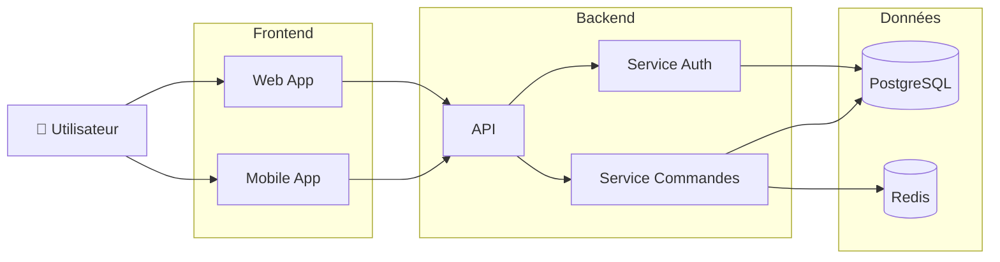

```mermaid
flowchart LR
    User["👤 Utilisateur"]

    subgraph Front["Frontend"]
        Web["Web App"]
        Mobile["Mobile App"]
    end

    subgraph Backend["Backend"]
        API["API"]
        Auth["Service Auth"]
        Orders["Service Commandes"]
    end

    subgraph Data["Données"]
        DB[("PostgreSQL")]
        Cache[("Redis")]
    end

    User --> Web
    User --> Mobile

    Web --> API
    Mobile --> API

    API --> Auth
    API --> Orders

    Auth --> DB
    Orders --> DB
    Orders --> Cache
```
