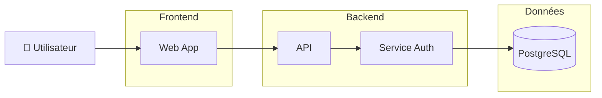

```mermaid
flowchart LR
    User["👤 Utilisateur"]

    subgraph Front["Frontend"]
        Web["Web App"]
    end

    subgraph Backend["Backend"]
        API["API"]
        Auth["Service Auth"]
    end

    subgraph Data["Données"]
        DB[("PostgreSQL")]
    end

    User --> Web

    Web --> API

    API --> Auth

    Auth --> DB
```
