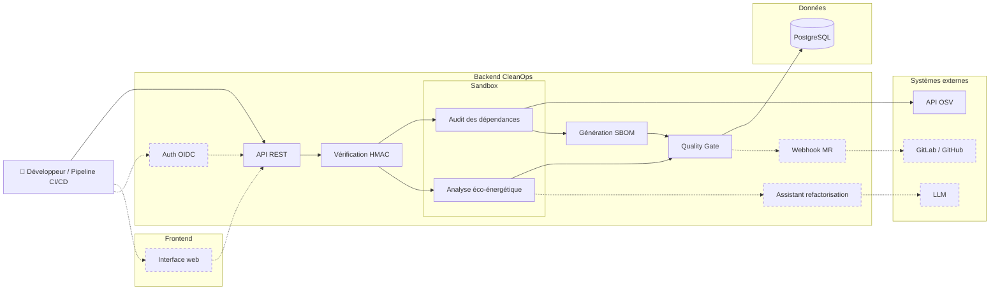

```mermaid
flowchart LR
    Client["👤 Développeur / Pipeline CI/CD"]

    subgraph Front["Frontend"]
        Web["Interface web"]
    end

    subgraph Backend["Backend CleanOps"]
        API["API REST"]
        OIDC["Auth OIDC"]
        HMAC["Vérification HMAC"]

        subgraph Sandbox["Sandbox"]
            Deps["Audit des dépendances"]
            Eco["Analyse éco-énergétique"]
        end

        SBOM["Génération SBOM"]
        Gate["Quality Gate"]
        Webhook["Webhook MR "]
        Refactor["Assistant refactorisation"]
    end

    subgraph Data["Données"]
        DB[("PostgreSQL")]
    end

    subgraph External["Systèmes externes"]
        OSV["API OSV"]
        LLM["LLM"]
        Git["GitLab / GitHub"]
    end

    Client --> API
    Client -.-> Web
    Web -.-> API
    Client -.-> OIDC
    OIDC -.-> API

    API --> HMAC
    HMAC --> Deps
    HMAC --> Eco

    Deps --> OSV
    Deps --> SBOM
    SBOM --> Gate
    Eco --> Gate

    Eco -.-> Refactor
    Refactor -.-> LLM

    Gate --> DB
    Gate -.-> Webhook
    Webhook -.-> Git

    classDef optional stroke-dasharray: 5 5
    class Web,OIDC,Webhook,Refactor,LLM,Git optional
```
