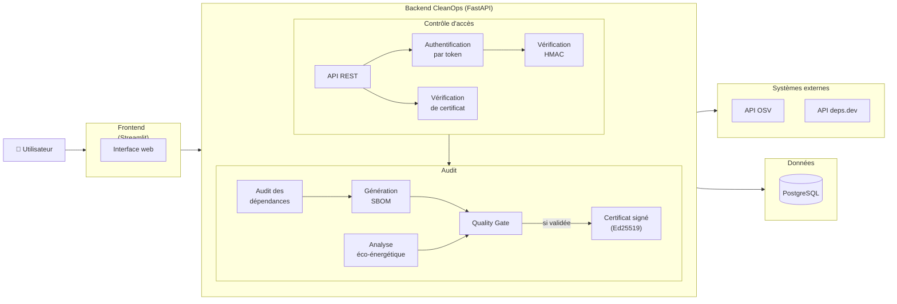

```mermaid
flowchart LR
    Client["👤 Utilisateur"]

    subgraph Front["Frontend<br/>(Streamlit)"]
        Web["Interface web"]
    end

    subgraph Backend["Backend CleanOps (FastAPI)"]
        direction TB
        subgraph Access["Contrôle d'accès"]
            direction LR
            API["API REST"] --> Auth["Authentification<br/>par token"] --> HMAC["Vérification<br/>HMAC"]
            API --> Verify["Vérification<br/>de certificat"]
        end
        subgraph Audit["Audit"]
            direction LR
            Deps["Audit des<br/>dépendances"] --> SBOM["Génération<br/>SBOM"] --> Gate["Quality Gate"]
            Eco["Analyse<br/>éco-énergétique"] --> Gate
            Gate -- "si validée" --> Cert["Certificat signé<br/>(Ed25519)"]
        end
        Access --> Audit
    end

    subgraph External["Systèmes externes"]
        direction TB
        OSV["API OSV"]
        DepsDev["API deps.dev"]
    end

    subgraph Data["Données"]
        DB[("PostgreSQL")]
    end

    Client --> Front
    Front --> Backend
    Backend --> External
    Backend --> Data
```
