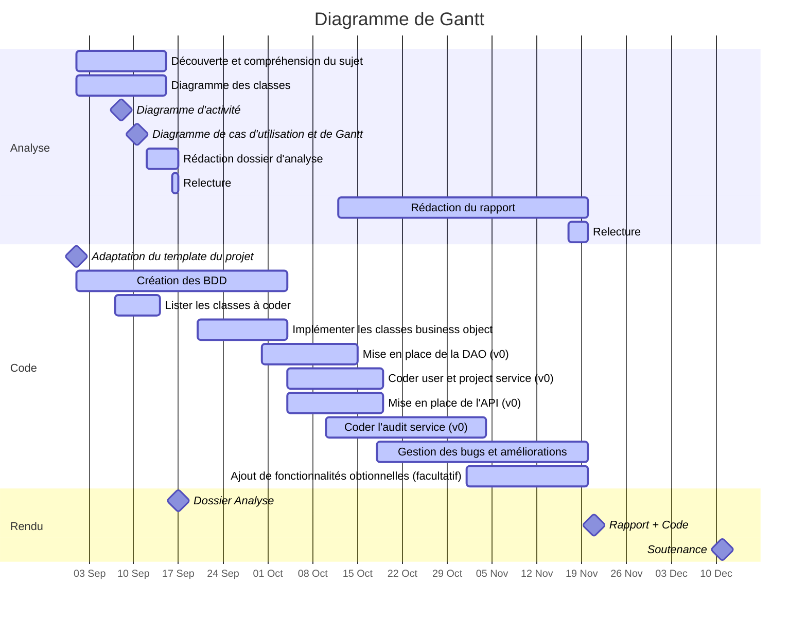

à utiliser avec **https://hackmd.io/**

# :clipboard:  Présentation du sujet

* **Sujet** : Application pour contrôler la qualité d'un code
* **Tuteur / Tutrice** : Adrien Lacaille
* [Dépôt GitHub](https://github.com/galahade-ncl/ensai-it-project-2a-team34.git)

# :dart: Planning des avancées et prévisionnel

# :calendar: Livrables

| Date    | Livrables                                                    |
| ------- | ------------------------------------------------------------ |
| 07 oct. | Dossier d'Analyse             |
| 25 nov. | Rapport final + code (:hammer_and_wrench:  [correcteur orthographe et grammaire](https://www.scribens.fr/))|
| 12 déc. | Soutenance                                                   |

# :construction: Todo List

## Dossier Analyse

* [ ] Diagramme de Gantt 
* [ ] Diagramme de cas d'utilisation
* [x] Diagramme de classe
* [x] Diagramme physique des données
* [ ] Répartition des parties à rédiger

## Code

* [x] Créer dépôt Git commun
  * [x] vérifier que tout le monde peut **push** et **pull**
* [ ] Version 0 de l'application
  * coder une et une seule fonctionnalité simple de A à Z, et faire tourner l'appli
  * cela permettra à toute l'équipe d'avoir une bonne base de départ
* [ ] Lister classes et méthodes à coder

---

* [ ] appel WS
* [ ] création WS
* [ ] Vue inscription
* [ ] hacher password

---

