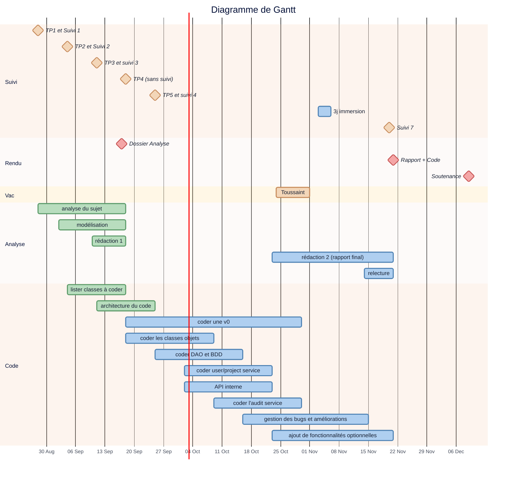

à utiliser avec **https://hackmd.io/**

# :clipboard:  Présentation du sujet

* **Sujet** : Application pour gérer et analyser des projets informatiques
* **Tuteur / Tutrice** : Adrien Lacaille (adrien.lacaille@gmail.com)
* [Dépôt GitHub](https://github.com/galahade-ncl/ensai-it-project-2a-team34.git)

# :dart: Échéances

---
Dossier d'Analyse :  :clock1: <iframe src="https://free.timeanddate.com/countdown/i83zdl7u/n1264/cf11/cm0/cu2/ct4/cs0/ca0/co0/cr0/ss0/cac009/cpcf00/pcfff/tcfff/fs100/szw256/szh108/iso2026-10-07T12:00:00" allowtransparency="true" frameborder="0" width="130" height="16"></iframe>

---

# :calendar: Livrables

| Date    | Livrables                                                    |
| ------- | ------------------------------------------------------------ |
| 17 sep. | [Dossier d'Analyse](https://www.overleaf.com/)               |
| 21 nov. | Rapport final + code (:hammer_and_wrench:  [correcteur orthographe et grammaire](https://www.scribens.fr/))|
|  9 déc. | Soutenance                                                   |

# :construction: Todo List

## Dossier Analyse

* [x] Diagramme de Gantt
* [x] Diagramme de cas d'utilisation
* [x] Diagramme de classe
* [x] Diagramme d'activité
* [x] Diagramme de séquence
* [x] Diagramme de package
* [x] Répartition des parties à rédiger
* [x] Template pdf

## Code

* [x] Créer dépôt Git commun
  * [ ] vérifier que tout le monde peut **push** et **pull**
* [x] Lister classes et méthodes à coder
* [x] Réflechir à l'architecture du code
* [ ] Version 0 de l'application
  * [ ] coder les classes objets
  * [ ] coder les bases de données + DAO
  * [ ] coder la partie service
  * [ ] coder l'API (main + controller)
  * [ ] tests unitaires
* [ ] Gérer les éventuels bugs
* [ ] Créer un frontend

## Rendu final

## Soutenance

---

